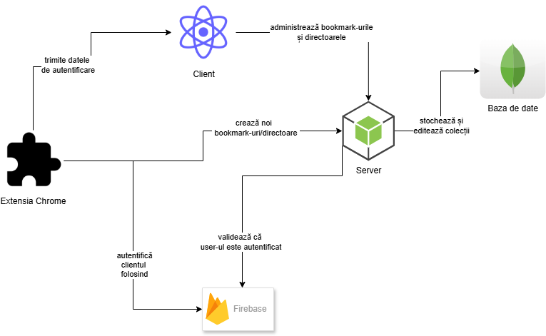

# Web app for managing bookmarks

ReMind was designed to overcome traditional limitations and transform bookmark management into a more efficient and intuitive experience. Unlike classic solutions, this project stands out by offering unique features such as generating summaries of saved pages and a recommendation system that suggests the appropriate storage directory for bookmarks based on relevant tags extracted from the page content. Other strengths of the ReMind application include integration with a Chrome extension for convenient page saving during browsing, the ability to choose a representative image for each bookmark, and the organization of bookmarks into customizable directories and subdirectories.